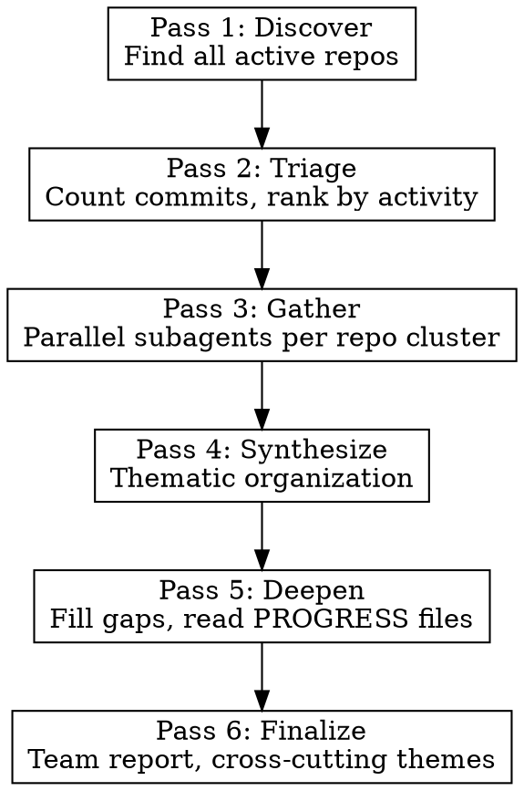

# GitHub Activity Review

Periodic cross-repository review of GitHub activity, organized thematically with
appropriate depth. Produces a structured report in `scratch/`.

## Parameters

- **Period**: Default 2 weeks. User can override (e.g., "last month", "since March 1").
- **GitHub user**: Detect from `gh auth status`. User can override.
- **Orgs**: Detect from `gh api user/orgs`. User can specify which are relevant.

## Process



### Pass 1: Discover Active Repos

```bash
# Get orgs
gh api user/orgs --jq '.[].login'

# For each relevant org, find repos pushed in period
gh api "orgs/ORG/repos?sort=pushed&per_page=30&type=all" \
  --jq '.[] | select(.pushed_at > "SINCE_DATE") | .full_name'

# Also check personal repos
gh api "users/USER/repos?sort=pushed&per_page=20&type=owner" \
  --jq '.[] | select(.pushed_at > "SINCE_DATE") | .full_name'
```

### Pass 2: Triage by Commit Count

For each discovered repo, count commits by the user and by others:

```bash
gh api "repos/REPO/commits?since=SINCE&author=USER&per_page=100" --jq 'length'
gh api "repos/REPO/commits?since=SINCE&per_page=100" --jq 'length'
```

Rank repos into tiers:
- **Heavy** (20+ user commits): Full investigation with PROGRESS files
- **Moderate** (5-19): Commit log analysis with theme grouping
- **Light** (1-4): Brief summary
- **Others only** (0 user, >0 total): Team activity section

### Pass 3: Gather Data (Parallel Subagents)

Dispatch subagents in parallel. Group small repos into a single agent. For each:

1. **README** (first 80 lines): `gh api repos/REPO/readme --jq .content | base64 -d | head -80`
2. **User's commits**: `gh api "repos/REPO/commits?since=SINCE&author=USER&per_page=100" --jq '.[] | "\(.commit.committer.date) \(.sha[0:8]) \(.commit.message | split("\n")[0])"'`
3. **Others' commits**: same query filtering `select(.author.login != "USER")`
4. **PRs**: `gh pr list --repo REPO --state all --search "created:>SINCE" --limit 20 --json number,title,author,state,mergedAt`
5. **PROGRESS.md / CHANGELOG.md**: `gh api repos/REPO/contents/PROGRESS.md --jq .content | base64 -d | head -200`

**IMPORTANT: Subagents often lack Bash permissions. Gather all raw data yourself
in the main conversation, then use subagents only for analysis/writing if needed.**

### Pass 4: Synthesize Thematically

**Do NOT organize the report repo-by-repo only.** The first sections should be thematic:

1. Read all gathered data
2. Identify cross-cutting themes (shared techniques, common goals, connected projects)
3. Look for mono-repos, submodules, and shared libraries that tie projects together
4. Group commits by intellectual contribution, not just repository

Common themes to look for:
- Same technique applied across repos (e.g., contrastive learning, JIT compilation)
- Pipeline stages (data prep -> training -> evaluation -> deployment)
- Shared infrastructure or library development
- Factored/disentangled representations across different model types
- Validation against gold-standard comparators

### Pass 5: Deepen (Critical -- Do Not Skip)

After the initial synthesis, actively look for gaps:

- **PROGRESS.md files**: These contain versioned experimental results with quantitative
  outcomes, ablation tables, and methodological decisions. They are far more informative
  than commit messages alone. Read them for any repo with 10+ commits.
- **Submodule relationships**: Check `.gitmodules` for mono-repos. Trace how subprojects
  relate to each other (shared data pipelines, common evaluation frameworks).
- **Cross-repo patterns**: If the same function/technique name appears in multiple repos
  (e.g., "phaser", "contrastive", "STP"), trace how it was developed in one and applied
  in others.
- **Quantitative results**: Pull specific numbers (error rates, speedups, SRM values,
  accuracy) -- these make the report concrete rather than vague.
- **Negative results**: Architecture ablations that failed, approaches that were rejected.
  These are often the most interesting findings.

### Pass 6: Finalize

Write the report to `scratch/YYYY-MM-DD-github-activity-review/README.md`.

**Report structure:**

```markdown
# Cross-Repository Activity Report: USERNAME

**Period:** DATE_RANGE
**Organization:** ORG_NAMES

## Executive Summary
3-5 bullet points on major thrusts with commit counts.

## Thematic Analysis

### Theme 1: [Descriptive Name]
Cross-cutting narrative tying together work across repos.
Include quantitative results, key decisions, connections.

### Theme 2: ...

## Per-Repository Details

### Repo Name (N commits by user, M by others)
**What it is:** 1-2 sentences from README.
**Key work:** Grouped by feature/theme, not chronological.
**Results:** Specific numbers from PROGRESS files.

## Team Activity

| Contributor | Repos | Activity Summary |
|---|---|---|
| name | repo list | What they did |
```

## Common Mistakes

| Mistake | Fix |
|---------|-----|
| Organizing only by repo, not by theme | Lead with thematic sections; repos are reference |
| Ignoring PROGRESS.md files | These have the real results; always check heavy repos |
| Missing submodule relationships | Check `.gitmodules`; mono-repos hide connected work |
| Shallow commit-message-only analysis | Read PRs, PROGRESS files, and README for context |
| Skipping team member activity | Always include "others only" repos in team section |
| Not tracing cross-repo techniques | If same keyword appears in 2+ repos, it's a theme |
| Vague summaries without numbers | Pull specific metrics, error rates, speedups |
| Single-pass report | The deepen pass catches 30-50% of the interesting content |
